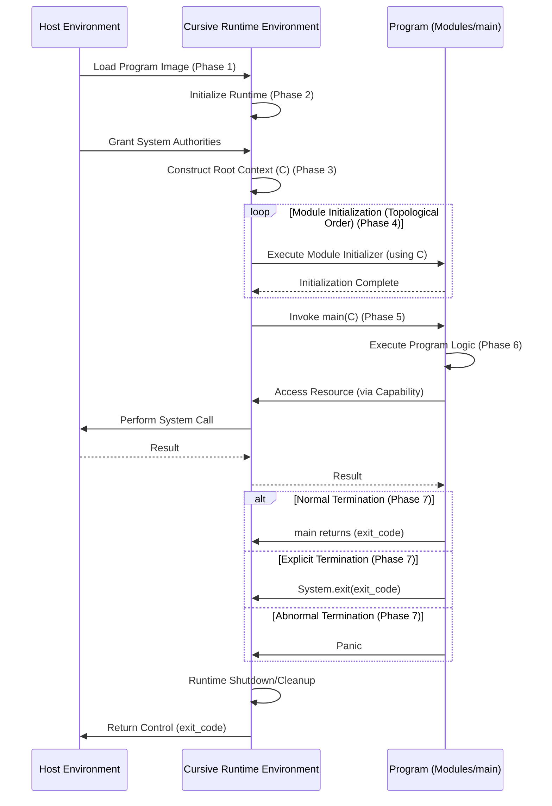

Migrating content from [23.4 Program Entry, 30.3.3 System.exit, 14. Initialization] and implicit execution concepts to [6.5 Program Execution] using the [System Definition] and [Language Construct] templates.

## 6.5 Program Execution \`\`

\<u\>**Definition**\</u\>
**Program Execution** is the realization of the behavior defined by a conforming Cursive program within a host environment. This process is managed by the **Cursive Runtime Environment (CRE)**, an implementation-defined component that implements the Cursive Abstract Machine (1.2).

The execution lifecycle defines the ordered sequence of operations required to initialize the program state, invoke the entry point, manage effects, and terminate execution. All execution is governed by the Object-Capability Model (Clause 12), ensuring that interactions with the Host Environment are mediated through explicit capabilities.

\<u\>**Static Semantics**\</u\>
[Implicitly derived]
A compiled artifact intended for execution (an executable assembly) **MUST** satisfy the following invariants prior to execution:

1.  **Well-Formedness:** The artifact **MUST** be the result of a successful compilation of a well-formed Cursive program (Clause 4).
2.  **Entry Point:** The artifact **MUST** define exactly one program entry point (6.5.1).
3.  **Initialization Validity:** The module dependency graph (Clause 11), restricted to eager dependencies, **MUST** be a Directed Acyclic Graph (DAG), ensuring a deterministic initialization order (14.3.3).

\<u\>**Dynamic Semantics**\</u\>
The execution lifecycle of a Cursive program **MUST** proceed through the following abstract phases in order:

1.  **Phase 1: Loading and Linking**
    The Host Environment loads the executable artifact and any required dynamic libraries into memory. The CRE is initialized.

2.  **Phase 2: Runtime Initialization**
    The Cursive Runtime Environment (CRE) initializes its internal state required for execution (e.g., thread management structures, memory allocators). Static initialization (preparing memory regions for compile-time known data) occurs here or in Phase 1, as defined by the implementation's ABI.

3.  **Phase 3: Capability Root Construction**
    The CRE interfaces with the Host Environment to acquire the initial set of system authorities (e.g., file system access, network sockets). These authorities are encapsulated into the `Context` record (12.2), forming the **Root Capability Context**.

4.  **Phase 4: Dynamic Module Initialization**
    The CRE executes the dynamic initializers for all module-level bindings (`let`, `var`). This execution **MUST** respect the topological order derived from the Eager Dependency Graph (14.4). The `Context` object constructed in Phase 3 is available to these initializers. If any initializer fails (Panics), execution proceeds immediately to Abnormal Termination (6.5.2.3).

5.  **Phase 5: Entry Point Invocation**
    The CRE transfers control to the program's entry point (`main`), passing the constructed `Context` object as the sole argument (6.5.1).

6.  **Phase 6: Execution**
    The program executes according to the dynamic semantics defined in this specification, particularly Clauses 9 (Expressions) and 10 (Statements).

7.  **Phase 7: Termination**
    The program ceases execution through one of the defined termination modes (6.5.2). The CRE handles the exit status and performs final cleanup before returning control to the Host Environment.

\<u\>**Concurrency & Safety**\</u\>

1.  **Capability Safety:** All interactions with the Host Environment **MUST** be mediated through capabilities derived from the `Context` provided in Phase 3. The CRE **MUST NOT** grant ambient authority.
2.  **Initialization Safety:** The strict ordering of the initialization phases guarantees that capabilities are available before module initialization begins, and that module initialization completes before the `main` procedure is invoked.

\<u\>**Examples**\</u\>

**Example 1: Conceptual Runtime Execution Sequence Diagram**



-----

### 6.5.1 Program Entry (\<u\>main\</u\>) `[Construct]`

\<u\>**Definition**\</u\>
The **Program Entry Point** is a distinguished procedure named `main` that serves as the starting point for the execution of an executable assembly (Phase 5).

```ebnf
program_entry_point ::=
    "public" "procedure" "main"
    "(" "ctx" ":" "Context" ")"
    ":" "i32"
    <callable_body>
```

\<u\>**Constraints & Legality**\</u\>
An assembly configured as an `executable` (11.1) **MUST** satisfy the following constraints. Failure to do so renders the program ill-formed.

1.  **Uniqueness:** The assembly **MUST** contain exactly one declaration that satisfies the definition of `program_entry_point`.
2.  **Name and Visibility:** The procedure **MUST** be named `main` and **MUST** have `public` visibility.
3.  **Signature:** The procedure signature **MUST** exactly match the required capability injection signature.

**Formal Invariant (Signature):**
Let $P_{main}$ be the procedure designated as the entry point.

$$
\text{Visibility}(P_{main}) = \text{public} \quad \land \quad \text{Signature}(P_{main}) \equiv (\text{Context}) \to \text{i32}
$$4.  **No Generics:** The `main` procedure **MUST NOT** declare any generic parameters.
5.  **No Contracts:** The `main` procedure **MUST NOT** have a contract clause (`[[...]]`), as there is no caller within the Cursive Abstract Machine to enforce preconditions.

| Code       | Severity | Description                                                                        |
| :--------- | :------- | :--------------------------------------------------------------------------------- |
| E-PRG-0601 | Error    | Executable assembly is missing a definition for the `main` procedure.              |
| E-PRG-0602 | Error    | Multiple definitions found for the `main` procedure (Link-time error).             |
| E-PRG-0603 | Error    | `main` procedure signature is incorrect. Expected `(ctx: Context) -> i32`.         |
| E-PRG-0604 | Error    | `main` procedure must have `public` visibility.                                    |
| E-PRG-0605 | Error    | `main` procedure must not be generic.                                              |
| E-PRG-0606 | Error    | `main` procedure must not have a contract clause.                                  |

&lt;u&gt;**Static Semantics**&lt;/u&gt;
During the linking phase, the implementation **MUST** identify the unique declaration satisfying the constraints above and designate it as the entry point symbol for the resulting executable artifact.

If the assembly is configured as a `library`, the presence of a procedure named `main` has no special semantic effect and does not constitute a program entry point for the library itself.

&lt;u&gt;**Dynamic Semantics**&lt;/u&gt;
The `main` procedure is invoked during Phase 5 of Execution.

1.  **Invocation:** The Cursive Runtime Environment (CRE) calls the `main` procedure.
2.  **Capability Transfer:** The `Context` record constructed during Phase 3 is passed as the sole argument (`ctx`). Ownership (responsibility) of the `Context` is transferred to the `main` procedure.
3.  **Execution:** The body of `main` is executed. This constitutes Phase 6.
4.  **Return Value:** When `main` returns, its `i32` return value is captured by the CRE and used as the program's exit status during the Termination phase (6.5.2).

&lt;u&gt;**Examples**&lt;/u&gt;

**[Normative Example] Minimal Conforming Executable Program**

```cursive
// The 'Context' type is built-in and available in the Universe scope.
public procedure main(ctx: Context): i32 {
// Program logic utilizes capabilities from 'ctx' (e.g., ctx.fs, ctx.heap).

// Return 0 to indicate success to the host environment.
result 0;
}
```

**Invalid Example: Incorrect Signature (Missing Context)**

```cursive
public procedure main(): i32 {
result 0;
}
// error[E-PRG-0603]: main procedure signature is incorrect. Expected (ctx: Context) -> i32.
```

**Invalid Example: Generic main**

```cursive
public procedure main<T>(ctx: Context): i32 {
result 0;
}
// error[E-PRG-0605]: main procedure must not be generic.
```

-----

### 6.5.2 Termination \`\`

&lt;u&gt;**Definition**&lt;/u&gt;
**Program Termination** is the cessation of program execution and the transition to the final stage of the execution lifecycle (Phase 7). Termination results in an exit status code being reported to the Host Environment.

&lt;u&gt;**Dynamic Semantics**&lt;/u&gt;
A Cursive program terminates via one of three mechanisms: Normal Termination, Explicit Termination, or Abnormal Termination (Panic).

#### 6.5.2.1 Normal Termination

Normal termination occurs when the `main` procedure completes execution and returns control to the CRE.

1.  **Initiation:** The `main` procedure executes a `result` or `return` statement.
2.  **Cleanup (Main Thread):** The stack frame for `main` is unwound.
* All `defer` statements within `main` are executed in LIFO order.
* All responsible bindings owned by `main`, including the `Context` record, are dropped according to the Responsibility Model (6.3). The CRE **MUST** ensure that the `Drop` implementation for the `Context` correctly releases the underlying host environment resources.
3.  **Global Destructors:** Destructors for module-level bindings initialized during Phase 4 are executed. The order of destruction **MUST** be the reverse of the initialization order (14.4).
4.  **Exit Status:** The `i32` value returned by `main` is reported to the Host Environment. A value of `0` indicates success; non-zero values indicate failure.

#### 6.5.2.2 Explicit Termination

Explicit termination occurs when the program invokes the `exit` procedure provided by the `System` capability (12.3.3).

1.  **Initiation:** Invocation of `System.exit(code: i32)`.
2.  **Immediate Cessation:** The CRE **MUST** terminate the process immediately. The `exit` procedure does not return; its return type is the never type (`!`).
3.  **Cleanup Bypass:** Stack unwinding, `defer` execution, and `Drop` implementations **MUST NOT** occur.
4.  **Exit Status:** The provided `i32` code is reported directly to the Host Environment.

> [\!CAUTION]
> Explicit Termination bypasses Cursive's RAII guarantees. Resources managed by responsible bindings (e.g., file handles, memory buffers) may not be released correctly.

#### 6.5.2.3 Abnormal Termination (Panic)

Abnormal termination occurs when a thread encounters an unrecoverable runtime error (a Panic). Triggers include failed bounds checks, dynamic contract violations, integer overflow (in checked mode), module initialization failure (14.5), or explicit calls to the `panic()` intrinsic.

1.  **Initiation:** A Panic is raised on the currently executing thread.
2.  **Cleanup (Implementation-Defined):** The behavior regarding cleanup during a Panic is implementation-defined (IDB). The implementation **MUST** document in the Conformance Dossier whether it performs stack unwinding (executing `defer` and `Drop`) or immediate process abortion.
3.  **Termination:** If the panic is not recovered (Cursive does not currently define a recovery mechanism), the program terminates.
4.  **Exit Status:** The exit status reported to the Host Environment **MUST** be a non-zero value indicating failure. The specific value is implementation-defined (IDB).
$$